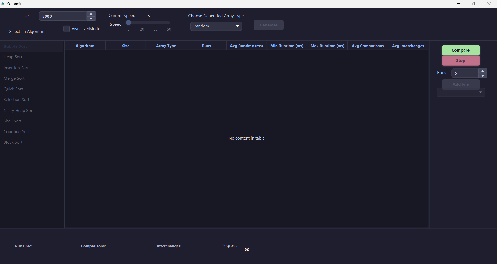
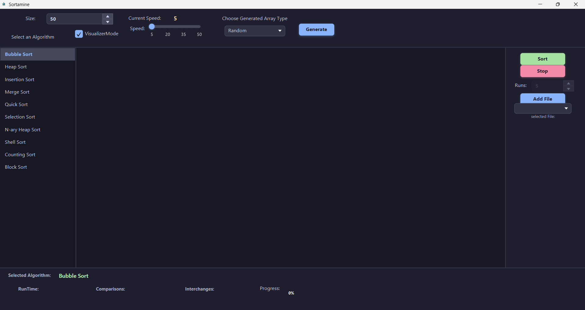
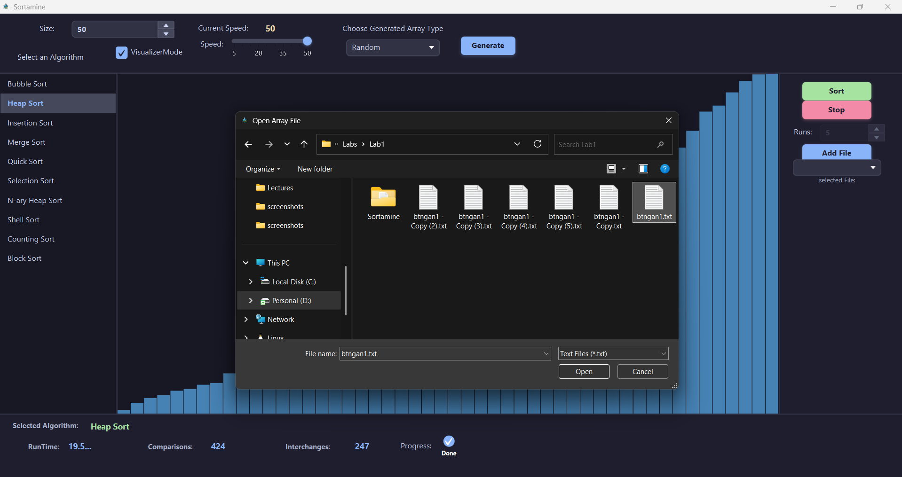
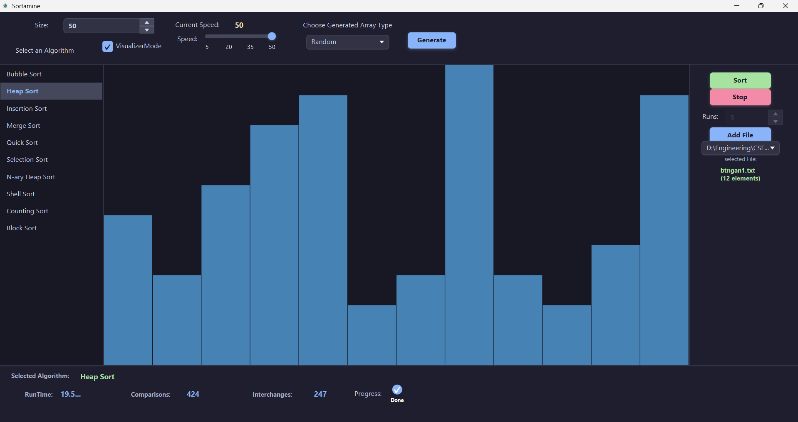
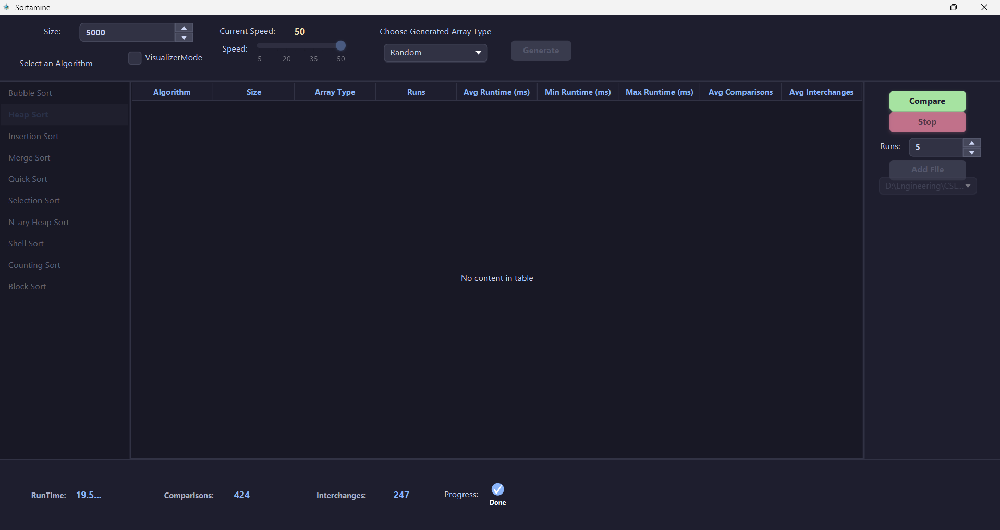
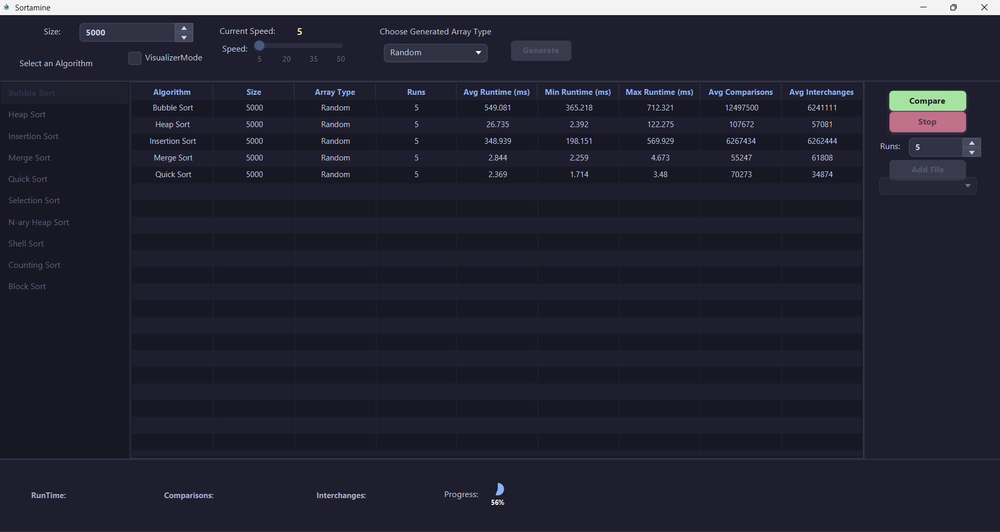
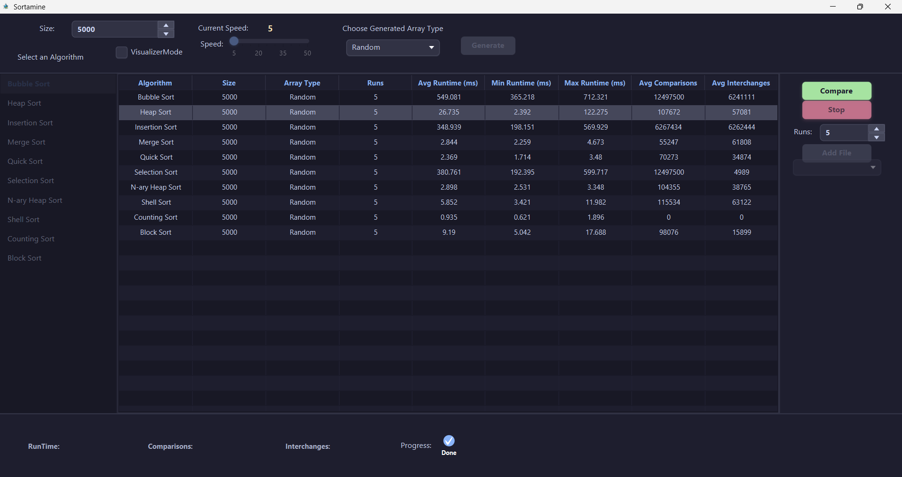
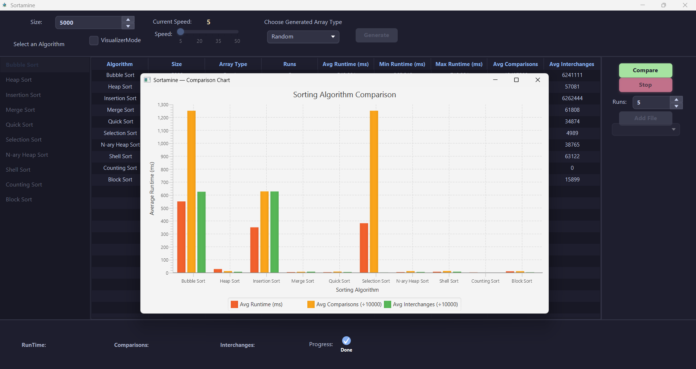
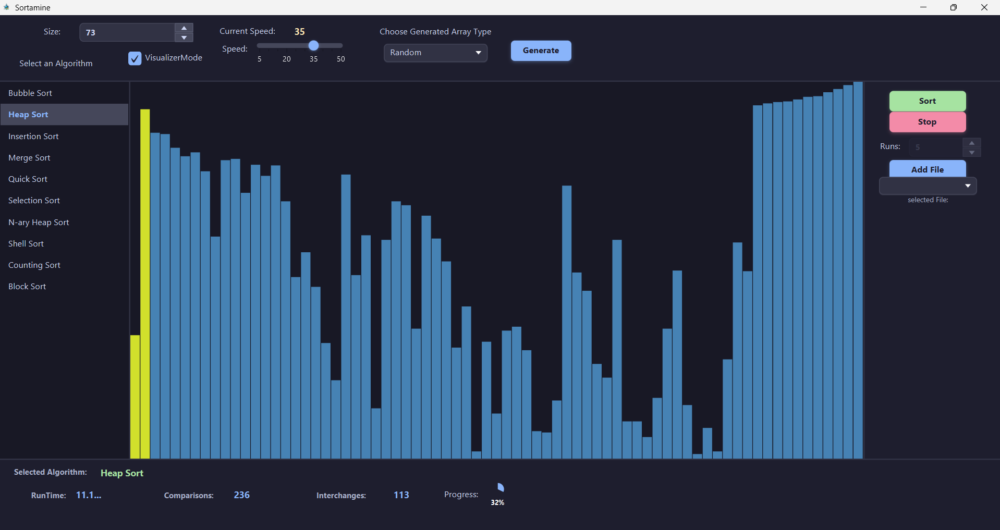

# Sortamine - Sorting Algorithm Visualizer & Comparator


*This is a university assignment for Data Structures and Algorithms course at Alexandria University CSED.*

## What this project does
Sortamine is a JavaFX-based application designed to analyze, compare, and visualize various sorting algorithms. It provides two main modes of operation:
1. **Sorting Comparison:** Evaluates the performance of algorithms across different array types and sizes over multiple runs, outputting average, minimum, and maximum runtimes, as well as average comparisons and interchanges.
2. **Sorting Visualization:** Provides an interactive, animated graphical representation of the sorting process using bar charts, with dynamic live metrics.
3. **Comparison Chart Generation:** Visualizes the tabular comparison results in a dynamically generated bar chart for quick relative performance analysis.

## Dataset / Input Format
The application supports multiple input methods for testing the algorithms:
- **Auto-generated Arrays:** Generates arrays of specified sizes (up to 10,000 for comparison, 100 for visualization). The generated arrays can be:
  - Randomly distributed
  - Already sorted
  - Inversely sorted
- **File Input:** Allows importing comma-separated integer files via a file selection dialog.

## Algorithms / Approach
The following sorting algorithms are implemented and compared in this project, along with their time complexities:

| Algorithm | Best Case | Average Case | Worst Case |
| :--- | :--- | :--- | :--- |
| **Selection Sort** | O(n²) | O(n²) | O(n²) |
| **Insertion Sort** | O(n) | O(n²) | O(n²) |
| **Bubble Sort** | O(n) | O(n²) | O(n²) |
| **Merge Sort** | O(n log n) | O(n log n) | O(n log n) |
| **Heap Sort** | O(n log n) | O(n log n) | O(n log n) |
| **Quick Sort** | O(n log n) | O(n log n) | O(n²) |
| **N-ary Heap Sort** | O(n log_d n) | O(n log_d n) | O(n log_d n) |
| **Shell Sort** | O(n log n) | O(n log n) | O(n²) |
| **Counting Sort** | O(n + k) | O(n + k) | O(n + k) |
| **Block Sort** | O(n) | O(n log n) | O(n log n) |

## Design Choices
- **UI Framework:** JavaFX is used for the graphical interface due to its robust tools for building rich desktop applications and rendering dynamic visual components.
- **Build Tool:** Maven is used for dependency management and building the project, ensuring a standardized build process.
- **Architecture:** The core sorting logic is decoupled from the UI components. The comparison logic is separated from the visualization step updates, enabling efficient performance measurements when not rendering.
- **Two-Tier Visualization:** Out-of-place algorithms like Merge Sort and Block Sort dynamically utilize a split two-pane visualization to represent auxiliary arrays and make the process clearer.
- **Color-Coded Feedback:** The visualization engine uses dynamic color-coding to highlight elements that are currently being compared (e.g., yellow) or swapped/selected (e.g., green).
- **Customizable Algorithms:** Parameters such as the arity (`N`) for N-ary Heap Sort can be adjusted directly from the user interface.

## Project Structure
```text
Sortamine/
├── pom.xml                # Maven configuration and dependencies
├── src/
│   └── main/
│       ├── java/          # Java source code (Controllers, Models, Sorting Logic)
│       └── resources/     # FXML files, CSS styles, and other assets
└── docs/
    └── screenshots/       # Assignment requirements and application screenshots
```

## How to Run
Ensure you have **Java 21** and **Maven** installed on your system.

1. Clone the repository or navigate to the project directory.
2. Run the application using the Maven JavaFX plugin:
   ```bash
   mvn clean javafx:run
   ```

## Screenshots

Here are some screenshots demonstrating the application's capabilities:

### Application Dashboard

*Dashboard in Comparison Mode (Idle state).*


*Dashboard in Visualization Mode (Idle state).*

### File Input

*File input selection dialog before loading data.*


*File input dialog after successfully loading and parsing the data.*

### Comparison Mode

*Comparison mode table before running the algorithms.*


*Comparison mode table while tests are running.*


*Comparison mode table after all algorithms have finished execution.*


*Bar chart representation of the comparison results.*

### Visualization Mode

*Live visualization of the Heap Sort algorithm in progress.*

## Observations / Known Limitations
- **Visualization Constraint:** The visualization mode is intentionally limited to a maximum of 100 elements. Rendering more elements can cause visual clutter and degrade the animation performance.
- **Large Datasets:** While comparison mode handles up to 10,000 elements efficiently, running O(n²) algorithms (like Selection or Bubble Sort) on the maximum size, especially for multiple runs or inversely sorted data, may take a noticeable amount of time.

## Future Work
- Implement additional sorting algorithms (e.g., Radix Sort, Tim Sort) for broader comparison.
- Add support for exporting comparison results to CSV or PDF directly from the UI.
- Provide step-by-step playback controls (pause, step forward, step backward) for the visualization mode.
